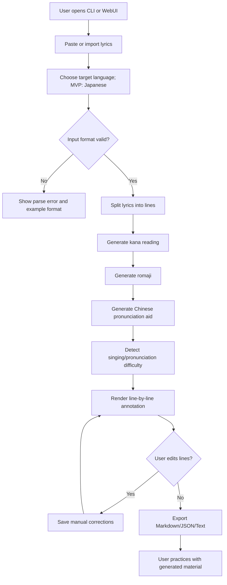

# 外语歌中文发音辅助跟唱工具 PRD

## 1. Executive Summary

我们要构建一个面向中文用户的外语歌曲跟唱标注工具，帮助“不熟悉目标语言读音但想唱外语歌”的用户，把歌词转换为可练习的多层标注：原文、目标语言读音层、拉丁转写、中文发音辅助、难点提示和节拍/拖长提示。MVP 先以日语歌曲验证文本处理闭环：用户粘贴或导入歌词，系统生成逐行标注，用户可手动修正并导出；不优先做播放器、录音打分、公开歌词库或完整语言学习课程。

## 2. Product Positioning

### Product Name

暂定：`SingBridge`

### One-Line Positioning

给中文用户用的外语歌跟唱标注工具。

### Language Strategy

产品名称、信息架构和数据模型不绑定日语。MVP 的第一种目标语言只做日语，因为日语存在假名、罗马音、长音、促音、拨音等明确的跟唱辅助需求；韩语、英语或其他语言只作为后续阶段扩展项，不进入 MVP 的功能验收范围。

扩展原则：

- 核心产品叫外语歌曲跟唱辅助，不叫日语歌曲工具。
- 数据结构使用通用字段，并允许语言特定层。
- 日语 MVP 可以有 `kana` 字段，但通用展示层应叫 `reading` 或 `phoneticLayer`。
- 韩语未来扩展可对应 Hangul 分解、罗马化、中文发音辅助和收音提示。
- 英语未来扩展可对应原词、音标/近似音节、中文发音辅助、连读弱读提示。

### Design Direction

主风格采用 Claude：安静、温和、解释型、适合长时间阅读和学习。

轻度借用 Spotify：当前练习句高亮、音乐状态感、深色练习模式、进度氛围。

辅助结构参考 Notion：歌词逐行、注释块、可编辑文本和结构化说明。

### Not Building

- 不做完整外语课程。
- 不做标准语音学训练平台。
- 不承诺中文发音辅助等于标准目标语言发音。
- MVP 不做逐句播放、录音评分、AI 纠音。
- MVP 不做公开热门歌曲歌词库。
- MVP 不做多用户社区、收藏榜单、评论区。
- MVP 不做移动 App，先做可本地验证的 CLI 和后续 WebUI。

## 3. Problem Statement

### Who Has This Problem?

喜欢外语歌的中文用户。MVP 优先服务日语歌、动漫歌、Vocaloid、J-pop、日剧 OST 场景，其中很多用户不会五十音，或只会一点假名但无法快速跟唱完整歌曲。

### What Is The Problem?

用户能找到歌词和罗马音，但仍然容易唱不顺：

- 不知道日语原文如何对应假名。
- 罗马音能读，但中文用户对 `tsu`、`fu`、`r/ら行`、`shi/chi/ji` 等音不直观。
- 中文拼音近似读音可以帮助入门，但无法表达长音、促音、拨音和节拍。
- 歌词站通常只展示歌词，不解释哪些地方容易唱错。

### Why Is It Painful?

- 用户想唱歌，不想先系统学习五十音。
- 普通罗马音不够中文友好。
- 只用中文拼音又会丢失日语关键发音差异。
- 一句句手动查假名、罗马音和发音提示很费时间。

### Evidence Level

当前为产品假设，来自用户访谈式需求描述。MVP 目标是用可运行文本工具验证：用户是否愿意输入一首歌并使用生成的多层标注练习。

## 4. Target Users & Personas

### Primary Persona: 想唱会一首歌的中文用户

- 会中文拼音。
- 不会或不熟悉五十音。
- 想快速跟唱一首外语歌；MVP 场景是一首日语歌。
- 接受“近似辅助”，但希望关键难点有提示。
- 不关心语言学术准确性，关心唱得顺、少走音。

### Secondary Persona: 学过一点目标语言的歌曲爱好者

- 认识部分假名。
- 希望看到原文、假名、罗马音共同对照。
- 对长音、促音、拨音等规则有基本兴趣。
- 可能会手动修正系统生成结果。

### Tertiary Persona: 语言老师/翻唱教学内容创作者

- 希望快速生成教学辅助材料。
- 需要可导出、可编辑、可截图的标注。
- 对准确性要求更高，会参与人工修正。

## 5. Core User Jobs

- 当我想学唱一首外语歌时，我想粘贴歌词并自动得到目标语言读音层、拉丁转写和中文发音辅助，这样我可以马上开始练。MVP 中这对应日语的假名、罗马音和中文发音辅助。
- 当一行歌词包含难发音时，我想看到额外提示，这样我知道哪里要拖长、停顿或避免按中文读死。
- 当系统生成的标注不符合我唱歌习惯时，我想逐行修改，这样最终结果适合我自己练习。
- 当我整理好一首歌时，我想导出文本或图片，这样我可以在手机、聊天软件或练习材料里使用。

## 6. Solution Overview

MVP 是一个文本处理工具，输入外语歌词并指定目标语言。第一阶段支持日语，输出逐行多层标注：

```text
原文：きっと忘れない
假名：きっとわすれない
罗马音：kitto wasurenai
中文发音辅助：ki t-to wa su le nai
难点：小「っ」短暂停顿半拍；「れ」接近 le/re 之间，不要读成中文“热”。
```

用户可以逐行查看、编辑和导出。系统自动识别常见难点：长音、促音、拨音、拗音、浊音/半浊音、中文用户易错音、可能需要拖长或短促处理的位置。

后续 WebUI 将呈现为温和的学习界面：左侧或主区显示歌词行，右侧/下方显示解释提示；当前练习行使用 Spotify 式状态高亮，但整体保持 Claude 式低噪音阅读体验。

## 7. MVP Scope

### In Scope

- 粘贴外语歌词文本；MVP 支持日语歌词。
- 支持纯文本和简单 LRC-like 输入。
- 按行解析歌词。
- 生成假名。
- 生成罗马音。
- 生成中文发音辅助。
- 标注发音难点。
- 标注长音、促音等节拍提示。
- 支持逐行人工修正。
- 导出 Markdown / JSON / 简单文本。
- CLI 先行，确保核心转换可测试。

### Out Of Scope For MVP

- 自动联网搜索歌词。
- 公开歌曲库。
- 音频播放与逐句播放。
- 录音、评分、AI 纠音。
- 用户账号、同步、收藏。
- 社区分享。
- 商业版权授权流程。
- 移动端 App。

### Future Scope

- 输入歌名后辅助搜索歌词来源，用户确认后导入。
- 扩展韩语歌曲：Hangul 分解、罗马化、中文发音辅助、收音/连音提示。
- 扩展英语歌曲：音标或近似音节、中文发音辅助、连读/弱读/吞音提示。
- LRC 时间轴对齐。
- 逐句播放/AB 循环。
- 深色练习模式。
- 歌曲项目库。
- 发音规则偏好：更像中文拼音 / 更接近目标语言。
- AI 难点解释与个性化练习建议。

## 8. User Flow



## 9. Functional Requirements

### FR1: Lyrics Input

**Goal:** Accept user-provided Japanese lyrics.

**Input:**

- Plain text Japanese lyrics.
- Optional LRC-like lines, e.g. `[00:12.30]きっと忘れない`.

**Output:**

- Normalized line list with optional timestamps.

**Business Boundary:**

- MVP only accepts user-provided text.
- No automatic lyrics search in MVP.
- Empty lines preserve stanza breaks.

**Exceptions:**

- Empty input: show clear error.
- Unsupported file encoding: show error and suggest UTF-8.
- Lines with no Japanese characters: preserve but mark as non-Japanese.

**Test Conditions:**

- Plain lyrics split into correct lines.
- LRC timestamps parsed when present.
- Blank lines preserved.
- Empty input exits non-zero in CLI.

**Automation:**

- Unit tests for parser.
- CLI test with fixture files.

### FR2: Kana Generation

**Goal:** Generate kana reading for each Japanese lyric line.

**Input:**

- Japanese text containing kana, kanji, punctuation, spaces.

**Output:**

- Hiragana reading per line.
- Unknown/ambiguous segments marked for manual review.

**Business Boundary:**

- MVP may use a dictionary-based morphological analyzer or browser/server-side library.
- Kanji readings can be wrong for song lyrics; must allow manual correction.

**Exceptions:**

- Ambiguous kanji reading: mark `needs_review`.
- Analyzer unavailable: preserve original text and report degraded output.

**Test Conditions:**

- Kana-only line remains stable.
- Common kanji phrase gets reading.
- Ambiguous/unknown phrase is flagged.

**Automation:**

- Unit tests with fixed Japanese fixtures.
- Snapshot tests for generated annotation JSON.

### FR3: Romaji Generation

**Goal:** Generate Hepburn-like romaji for kana.

**Input:**

- Hiragana/katakana reading.

**Output:**

- Romaji text.

**Business Boundary:**

- Prefer singing-friendly readability over academic transliteration.
- Long vowels should preserve visible duration markers where useful.

**Exceptions:**

- Non-kana characters pass through or are ignored according to parser rules.

**Test Conditions:**

- `きっと` -> `kitto`.
- `ありがとう` -> `arigatou` or configured long-vowel representation.
- `しゃしん` -> `shashin`.

**Automation:**

- Unit tests for kana-to-romaji rules.

### FR4: Chinese Pronunciation Aid

**Goal:** Generate Chinese-user-friendly pronunciation aid without pretending it is exact Japanese.

**Input:**

- Kana reading and romaji.

**Output:**

- Per-line Chinese pronunciation aid using familiar Latin/pinyin-like chunks.

**Business Boundary:**

- Label must be `中文发音辅助`.
- Do not call it `标准发音`.
- Output should expose hard-to-express features through symbols and notes:
  - Long sound: `to-o`, `ne-e`, or trailing marker.
  - Small `っ`: `t-to`, `[停半拍]`.
  - `ん`: note context-sensitive nasal sound.

**Exceptions:**

- If a sound has no good Mandarin approximation, keep romaji-like chunk and add note.

**Test Conditions:**

- `つ` produces a special warning, not a naive `ci`.
- `ふ` produces a special warning, not just `fu` with no explanation.
- `ら/り/る/れ/ろ` get an optional `l/r` reminder.

**Automation:**

- Unit tests for common kana groups.
- Snapshot tests for difficult lines.

### FR5: Difficulty Detection

**Goal:** Highlight places Chinese users are likely to sing wrong.

**Input:**

- Kana reading, romaji, line metadata.

**Output:**

- Difficulty notes per line.

**Rules To Detect:**

- Long vowels: `おう`, `えい`, `ー`, repeated vowels.
- Small `っ`:促音 / short stop.
- Small ゃ/ゅ/ょ:拗音.
- `ん`:拨音, especially before b/m/p, k/g, t/d, vowels.
- `つ`, `ふ`, `し`, `ち`, `じ`.
- ら行.
- Voiced/semi-voiced sounds: が, ざ, だ, ば, ぱ.
- Song-friendly continuation markers when punctuation or elongated vowels imply holding.

**Business Boundary:**

- MVP detects text-level difficulty only.
- Audio-derived rhythm detection is out of scope.

**Exceptions:**

- If note confidence is low, phrase as a gentle reminder rather than a hard correction.

**Test Conditions:**

- Lines containing small `っ` always receive a stop note.
- Lines containing `つ` receive a Chinese-user warning.
- Lines with no difficult features can have empty notes.

**Automation:**

- Unit tests for detection rules.

### FR6: Manual Correction

**Goal:** Let users correct generated readings and pronunciation aid.

**Input:**

- Generated annotation object.
- User edits per line.

**Output:**

- Updated annotation object with manual override fields.

**Business Boundary:**

- MVP can support correction via JSON or Markdown edit flow in CLI.
- WebUI correction comes after CLI data model is stable.

**Exceptions:**

- Invalid correction file: show line-level validation errors.

**Test Conditions:**

- Manual kana override updates downstream romaji if requested.
- Manual pronunciation aid override is preserved on export.
- Invalid JSON returns non-zero exit code.

**Automation:**

- CLI integration test with correction fixture.

### FR7: Export

**Goal:** Export practice-ready material.

**Input:**

- Annotation object.

**Output:**

- Markdown.
- JSON.
- Plain text.

**Business Boundary:**

- Image/PDF export is future scope unless needed for early sharing tests.

**Exceptions:**

- Output path not writable: show error and suggest alternative.

**Test Conditions:**

- Markdown contains all selected layers.
- JSON schema remains stable.
- Plain text is readable when copied to chat apps.

**Automation:**

- Snapshot tests for export formats.

## 10. Non-Functional Requirements

- Offline-first for MVP conversion where possible.
- Clear warnings when dictionary/analyzer output may be wrong.
- UTF-8 by default.
- Deterministic output for tests.
- No API key required for basic conversion.
- User-provided lyrics should not be uploaded unless user explicitly enables cloud/AI features in future versions.
- Interface copy should be gentle and precise, not judgmental.

## 11. Technical Architecture Draft

### Runtime Shape

MVP:

- CLI
- Local script/library
- File-based input/output

Post-MVP:

- Web application
- Optional backend for lyrics search or AI explanation
- Optional local browser-only mode for pasted lyrics

### Module Boundaries

```text
Input Layer
  - Text parser
  - LRC parser
  - File loader

Processing Layer
  - Japanese text normalizer
  - Kana reading generator
  - Kana-to-romaji converter
  - Chinese pronunciation aid generator
  - Difficulty detector

Storage Layer
  - JSON project file
  - Fixture files for tests

Output Layer
  - Markdown exporter
  - JSON exporter
  - Plain text exporter
  - Future WebUI renderer

External Integration Layer
  - Optional kana analyzer/dictionary
  - Future lyrics search
  - Future AI explanation
```

### Data Flow

```text
User lyrics
-> parse lines
-> normalize Japanese text
-> generate kana
-> generate romaji
-> generate Chinese pronunciation aid
-> detect difficulty notes
-> produce annotation JSON
-> user corrections
-> export practice material
```

### Failure Handling

- Analyzer unavailable: output original text, skip kana generation, mark line as `needs_review`.
- Unknown kanji reading: mark segment and continue.
- Lyrics search unavailable in future: fall back to paste/import.
- Export failure: no partial overwrite unless safely written to temp file first.

## 12. Technology Options

### Recommended MVP Stack

**Node.js + TypeScript CLI, then Vue 3 + Vite WebUI**

Pros:

- Good fit for future WebUI sharing.
- Easy JSON processing and CLI packaging.
- Can reuse conversion logic in a Vue frontend later.
- Works well on Windows.
- Vue 3 is a good fit for dense editable lyric rows, side panels, toggles, and practice-state views.

Cons:

- Japanese morphological analysis options may need native/dictionary assets.
- Some kana/romaji libraries may need validation.

Use when:

- We want CLI first, then a Vue 3 WebUI with shared logic.

Recommended structure:

```text
packages/core
  Lyrics parsing, Japanese reading adapters, romaji, Chinese pronunciation aid, difficulty detection

packages/cli
  singbridge annotate/export/validate

apps/web
  Vue 3 + Vite annotation viewer/editor, added after CLI output is stable
```

Recommended WebUI libraries:

- Vue 3
- Vite
- Pinia for local project/editing state
- Vue Router only when multiple screens are needed
- Vitest for unit tests
- Playwright for WebUI smoke tests after the prototype exists

### Alternative

**Python CLI**

Pros:

- Strong text processing ecosystem.
- Easy scripting and fixtures.
- Japanese NLP libraries are mature.

Cons:

- Later WebUI reuse may require API boundary or rewrite.
- Packaging for casual users can be less smooth.

Use when:

- Core text processing quality matters more than frontend reuse.

### Not Recommended For MVP

**Full-stack web app first**

Pros:

- Faster visible demo.

Cons:

- Violates CLI-first validation.
- UI may hide unstable conversion rules.
- Harder to test the core independently.

Reason not selected:

- Current risk is conversion quality and data model, not UI polish.

**Next.js or React SPA as the default WebUI**

Pros:

- Mature ecosystem and many component options.

Cons:

- Not needed for this project's current constraints.
- Next.js adds server/rendering decisions before the core conversion flow is stable.
- React would not provide enough advantage here to outweigh using the preferred Vue stack.

Reason not selected:

- The WebUI is an annotation editor, not an SSR-heavy content site. Vue 3 + Vite is simpler for the expected local-first workflow.

## 13. MVP Data Structure Draft

```json
{
  "version": 1,
  "title": "Song Title",
  "artist": "Artist Name",
  "source": {
    "type": "user_paste",
    "note": "User-provided lyrics"
  },
  "settings": {
    "pronunciationMode": "zh_assist",
    "romajiStyle": "singing_friendly"
  },
  "lines": [
    {
      "id": "line-001",
      "timestamp": "00:12.30",
      "original": "きっと忘れない",
      "kana": "きっとわすれない",
      "romaji": "kitto wasurenai",
      "zhAssist": "ki t-to wa su le nai",
      "difficultyNotes": [
        {
          "type": "sokuon",
          "span": "っ",
          "message": "小「っ」表示短暂停顿，像卡住半拍再进入后面的 to。"
        },
        {
          "type": "ra_row",
          "span": "れ",
          "message": "ら行接近 l/r 之间，不要读成中文“热”。"
        }
      ],
      "needsReview": false,
      "manualOverrides": {
        "kana": null,
        "romaji": null,
        "zhAssist": null,
        "notes": []
      }
    }
  ]
}
```

## 14. CLI Command Draft

### Generate Annotation

```text
singbridge annotate input.txt --language ja --out song.json
```

Expected:

- Reads UTF-8 lyrics.
- Writes annotation JSON.
- Non-zero exit if input is empty or unreadable.

### Export Markdown

```text
singbridge export song.json --format markdown --out song.md
```

Expected:

- Outputs readable multi-layer lyrics.
- Preserves manual overrides.

### Validate Project File

```text
singbridge validate song.json
```

Expected:

- Checks schema.
- Reports line-level errors.

### Show Help

```text
singbridge --help
```

Expected:

- Lists commands, inputs, outputs, examples.

## 15. WebUI Concept

Only build after CLI conversion is stable.

### Primary Screen

- Left/top: input or imported lyrics.
- Main: annotated lyrics line list.
- Each line shows:
  - 原文
  - 假名
  - Romaji
  - 中文发音辅助
  - 难点提示
- Current selected line gets subtle Spotify-like active state.
- Claude-like calm reading palette and spacious explanation cards.

### Editing

- Inline edit per layer.
- Mark line as reviewed.
- Toggle notes on/off.

### Practice Mode

Post-MVP:

- Focus one line at a time.
- Darker music-inspired mode.
- Large current lyric.
- Optional LRC timestamp awareness.

## 16. Success Metrics

### Primary MVP Metric

**Practice material completion rate**

Percentage of test users who can input one song and export usable annotated lyrics without developer help.

Target:

- 80% in a 5-user manual test.

### Secondary Metrics

- Time from paste to first exported annotation: under 2 minutes.
- Manual correction rate per line: track but not optimize initially.
- User-rated usefulness of difficulty notes: average 4/5 in manual test.

### Guardrail Metrics

- Users should understand that `中文发音辅助` is approximate, not standard pronunciation.
- No silent failure when kana generation is uncertain.

## 17. Risks And Mitigations

### Risk: Kanji Readings Are Wrong

Mitigation:

- Mark uncertain lines as `needs_review`.
- Make manual correction first-class.
- Use fixtures from real song-like text for tests.

### Risk: Chinese Pronunciation Aid Encourages Bad Pronunciation

Mitigation:

- Label as `中文发音辅助`.
- Add notes for sounds with no Mandarin equivalent.
- Provide “更接近日语” mode later.

### Risk: Lyrics Copyright

Mitigation:

- MVP uses user-provided lyrics.
- Do not ship public lyric database.
- Future search/import should keep source attribution and user confirmation.

### Risk: WebUI Built Before Core Is Stable

Mitigation:

- CLI first.
- Snapshot tests for conversion output.
- WebUI only after sample songs can be processed reliably.

### Risk: Too Much Language-Learning Scope

Mitigation:

- Keep product goal: learn to sing one song.
- No grammar lessons, vocabulary memorization, or course progression in MVP.

## 18. Open Questions

- Should MVP generate kana for kanji automatically, or require user-provided furigana when confidence is low?
- Which romaji style should be default: standard Hepburn or singing-friendly visible long vowels?
- What symbols are most intuitive for Chinese users to understand long sound and small `っ`?
- Should Chinese pronunciation aid use pure pinyin-like spelling or hybrid romaji/pinyin chunks?
- Do we need simplified/traditional Chinese copy in early versions?
- Should exported Markdown include all layers by default or allow layer selection?

## 19. Milestones

### Milestone 1: Core Text Pipeline

- Parse input lyrics.
- Generate annotation JSON with placeholder kana/romaji/zhAssist rules.
- Export Markdown.
- Validate schema.

### Milestone 2: Pronunciation Rules

- Implement kana-to-romaji.
- Implement Chinese pronunciation aid mapping.
- Implement difficulty detection rules.
- Add fixtures and snapshot tests.

### Milestone 3: Manual Correction

- Support JSON correction workflow.
- Preserve overrides.
- Re-export corrected material.

### Milestone 4: Small Sample Validation

- Test 3-5 representative song snippets.
- Record incorrect readings and confusing notes.
- Adjust rules.

### Milestone 5: WebUI Prototype

- Build annotation viewer/editor.
- Apply Claude primary style and light Spotify active states.
- Use existing fixture JSON, not live search.

## 20. Acceptance Criteria Summary

- A user can paste Japanese lyrics into CLI and receive a structured annotation file.
- The annotation includes original, kana, romaji, Chinese pronunciation aid, and difficulty notes.
- Long vowels, small `っ`, `ん`,拗音, and common Chinese-user difficult sounds are detected.
- User can manually correct generated fields.
- User can export Markdown.
- Invalid input and unavailable dependencies produce clear errors.
- Tests cover parsing, conversion, difficulty detection, export, and CLI failure cases.
