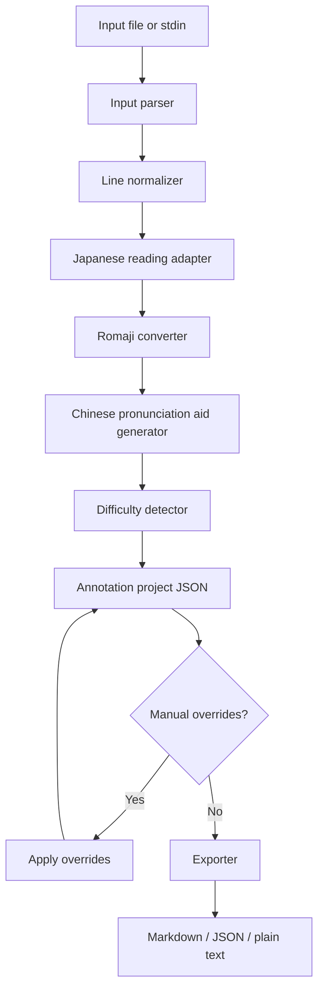

# SingBridge Technical Design

## 1. Scope

This document translates the PRD into an implementation plan for the MVP.

MVP scope:

- Japanese lyrics only.
- User-provided lyrics only.
- CLI first.
- JSON project file as the storage boundary.
- Export Markdown / JSON / plain text.
- Vue 3 WebUI only after CLI output and data model are stable.

Out of scope:

- Korean and English support.
- Automatic lyrics search.
- Public lyrics database.
- Audio playback, recording, scoring, and speech evaluation.
- User accounts, sync, sharing, and community features.

## 2. Recommended Stack

### Runtime

- Node.js
- TypeScript
- pnpm workspace

### Packages

```text
packages/core
  Pure conversion and data-model logic.

packages/cli
  singbridge command-line entry points.

apps/web
  Vue 3 + Vite annotation viewer/editor, added after CLI stabilization.
```

### Testing

- Vitest for unit and integration tests.
- Snapshot tests for exported JSON/Markdown fixtures.
- Playwright only after WebUI exists.

### Storage

- JSON files for project data.
- Markdown / text files for export.
- Fixture files for tests.
- No database in MVP.

## 3. Architecture



## 4. Module Boundaries

### packages/core

Owns deterministic business logic.

Suggested modules:

```text
src/schema/
  annotation.ts
  validation.ts

src/input/
  parseLyrics.ts
  parseLrc.ts
  normalizeLine.ts

src/japanese/
  readingAdapter.ts
  kanaNormalize.ts
  kanaToRomaji.ts

src/pronunciation/
  zhAssist.ts
  difficultyRules.ts

src/overrides/
  applyOverrides.ts

src/export/
  toMarkdown.ts
  toPlainText.ts
```

Rules:

- Core functions should not read or write files directly.
- Core functions should be deterministic for the same input and settings.
- External Japanese reading libraries must sit behind `readingAdapter`.
- If the reading adapter cannot determine a reading, return structured uncertainty instead of throwing for the whole song.

### packages/cli

Owns command parsing, file IO, exit codes, and user-facing errors.

Commands:

```text
singbridge annotate input.txt --language ja --out song.json
singbridge export song.json --format markdown --out song.md
singbridge validate song.json
singbridge --help
```

Rules:

- Return non-zero exit code on invalid input, unreadable files, invalid project JSON, and unwritable output paths.
- Error messages must include cause and next step.
- CLI should not contain conversion rules; it calls `packages/core`.

### apps/web

Deferred until CLI is stable.

Expected stack:

- Vue 3
- Vite
- Pinia for local project/edit state
- Vue Router only if more than one screen is needed

Rules:

- WebUI consumes the same annotation JSON schema as CLI.
- WebUI must not fork conversion logic into components.
- WebUI should start from fixture JSON before adding import/edit flows.

## 5. Data Model

### AnnotationProject

```ts
type LanguageCode = "ja";

interface AnnotationProject {
  version: 1;
  title?: string;
  artist?: string;
  language: LanguageCode;
  source: SourceInfo;
  settings: AnnotationSettings;
  lines: AnnotationLine[];
}
```

### SourceInfo

```ts
interface SourceInfo {
  type: "user_paste" | "file_import";
  note?: string;
  inputFile?: string;
}
```

### AnnotationSettings

```ts
interface AnnotationSettings {
  pronunciationMode: "zh_assist";
  romajiStyle: "singing_friendly";
}
```

### AnnotationLine

```ts
interface AnnotationLine {
  id: string;
  index: number;
  timestamp?: string;
  original: string;
  reading?: string;
  kana?: string;
  romaji?: string;
  zhAssist?: string;
  difficultyNotes: DifficultyNote[];
  needsReview: boolean;
  reviewReasons: ReviewReason[];
  manualOverrides: ManualOverrides;
}
```

### DifficultyNote

```ts
type DifficultyType =
  | "long_vowel"
  | "sokuon"
  | "youon"
  | "nasal_n"
  | "tsu"
  | "fu"
  | "shi_chi_ji"
  | "ra_row"
  | "voiced_sound"
  | "rhythm_hint";

interface DifficultyNote {
  type: DifficultyType;
  span: string;
  start?: number;
  end?: number;
  message: string;
  confidence: "high" | "medium" | "low";
}
```

### ManualOverrides

```ts
interface ManualOverrides {
  reading?: string | null;
  kana?: string | null;
  romaji?: string | null;
  zhAssist?: string | null;
  notes?: DifficultyNote[];
}
```

### ReviewReason

```ts
type ReviewReason =
  | "unknown_kanji_reading"
  | "mixed_language_line"
  | "reading_adapter_unavailable"
  | "non_japanese_line";
```

## 6. Processing Pipeline

### Step 1: Parse Input

Input:

- UTF-8 text file.
- Optional LRC-style timestamps.

Output:

- Ordered normalized line records.

Behavior:

- Preserve blank stanza separators.
- Preserve timestamps if present.
- Mark non-Japanese lines instead of deleting them.

### Step 2: Generate Japanese Reading

Input:

- Original Japanese line.

Output:

- `reading` / `kana`.
- `needsReview` when uncertain.

Implementation:

- Start with a replaceable adapter.
- Adapter can initially handle kana-only lines and known fixture phrases.
- Add dictionary/morphological analyzer later behind the same interface.

### Step 3: Convert Kana To Romaji

Input:

- Kana reading.

Output:

- Singing-friendly romaji.

Rules:

- Small `っ` doubles or separates the next consonant, e.g. `kitto`.
- 拗音 maps to `kya`, `shu`, `cho`, etc.
- Long vowels preserve readability; exact style is configurable later.

### Step 4: Generate Chinese Pronunciation Aid

Input:

- Kana and romaji.

Output:

- `zhAssist`.

Rules:

- Label is always `中文发音辅助`.
- Use hybrid romaji/pinyin-like chunks, not pure Mandarin pinyin.
- Preserve hard Japanese sounds with notes instead of forcing bad approximations.
- Represent small `っ` and long vowels visibly.

### Step 5: Detect Difficulty

Input:

- Kana, romaji, original line.

Output:

- `difficultyNotes`.

MVP rules:

- Long vowels: `おう`, `えい`, `ー`, repeated vowels.
- Sokuon: small `っ`.
- Youon: small `ゃ`, `ゅ`, `ょ`.
- Nasal `ん`.
- Chinese-user difficult sounds: `つ`, `ふ`, `し`, `ち`, `じ`, ら行.
- Voiced/semi-voiced sounds.

### Step 6: Apply Manual Overrides

Input:

- Project JSON and override data.

Output:

- Project JSON with effective values resolved.

Rules:

- Manual override wins over generated values.
- Preserve generated values unless explicitly replaced.
- Validate overrides before writing output.

### Step 7: Export

Formats:

- JSON: canonical project format.
- Markdown: practice material.
- Plain text: copy-friendly output.

Markdown should include:

- Song metadata if present.
- One block per lyric line.
- 原文 / 假名 / Romaji / 中文发音辅助 / 难点.

## 7. CLI Behavior

### annotate

```text
singbridge annotate input.txt --language ja --out song.json
```

Validation:

- Input file exists.
- Input is not empty.
- `--language` must be `ja` in MVP.
- Output path is writable.

Failure:

- Exit 1 for invalid input.
- Exit 2 for processing failure.
- Exit 3 for output failure.

### export

```text
singbridge export song.json --format markdown --out song.md
```

Validation:

- Project JSON is valid.
- Format is `markdown`, `json`, or `text`.

### validate

```text
singbridge validate song.json
```

Validation:

- JSON is parseable.
- Required fields exist.
- Line IDs are unique.
- MVP language is `ja`.

## 8. Error Handling

Use clear user-facing messages:

```text
Error: input file is empty.
Next step: provide a UTF-8 text file with Japanese lyrics.
```

```text
Error: only --language ja is supported in MVP.
Next step: use --language ja, or treat Korean/English as future expansion.
```

```text
Warning: reading for line 12 may be uncertain.
Next step: review the kana field before exporting practice material.
```

Warnings should not fail the whole command unless the output would be unusable.

## 9. Test Strategy

### Unit Tests

- Input parser.
- LRC timestamp parser.
- Kana normalization.
- Kana-to-romaji conversion.
- Chinese pronunciation aid mapping.
- Difficulty detection rules.
- Schema validation.

### Integration Tests

- `annotate` fixture input to JSON output.
- `export` project JSON to Markdown.
- `validate` valid and invalid project files.

### Snapshot Tests

Fixtures:

- Kana-only lyric line.
- Kanji + kana mixed line.
- Small `っ`.
- Long vowel.
- `ん` before different consonants.
- つ / ふ / ら行 examples.
- Non-Japanese line.

### Manual Verification

Use 3-5 short, user-provided song snippets.

Verify:

- Generated material is understandable to a Chinese user.
- Difficult sounds are clearly highlighted.
- Warnings do not feel too harsh.
- Exported Markdown is usable in a note app or chat app.

## 10. Implementation Constraints

- Do not implement WebUI before CLI fixtures pass.
- Do not add a database in MVP.
- Do not add network lyrics search in MVP.
- Do not upload user lyrics.
- Do not hard-code one song's special cases into generic rules.
- Keep language expansion behind explicit `language` adapters.

## 11. Current Implementation Snapshot

As of the current CLI MVP implementation, the repository contains:

- `packages/core`: parsing, annotation schema, validation, Japanese reading, romaji, Chinese pronunciation aid, difficulty rules, manual override resolution, and Markdown/plain-text export.
- `packages/cli`: command handling and file IO for `annotate`, `validate`, and `export`.
- `packages/core/fixtures/sample-validation-ja.txt`: a short synthetic fixture set for repeatable sample validation.

Implemented CLI commands:

```text
singbridge annotate input.txt --language ja --out song.json
singbridge validate song.json
singbridge export song.json --format markdown --out song.md
singbridge export song.json --format text --out song.txt
singbridge export song.json --format json --out song.json
```

The `annotate` command now uses a local `kuromoji` tokenizer and dictionary behind `packages/core/src/japanese/readingAdapter.ts`. The adapter runs offline and produces kana readings for many kanji-containing Japanese lines. Lines containing kanji still keep `needsReview: true` with `unknown_kanji_reading`, because song lyrics can use special readings that differ from dictionary readings.

The reading adapter currently also includes a small set of lyric-reading overrides discovered during sample validation:

- `響めき` -> `どよめき`
- `心魅かれてく` -> `こころひかれてく`
- `暗闇` -> `やみ`
- `想ってた` -> `おもっていた`
- `景色` -> `ばしょ`

These overrides are useful for the tested snippets but should not grow indefinitely as hard-coded rules. A later design should replace this with a cleaner reference-romaji alignment or per-song correction mechanism.

Manual correction behavior:

- Users may edit `manualOverrides.kana`, `manualOverrides.romaji`, `manualOverrides.zhAssist`, and `manualOverrides.notes` in the project JSON.
- If only `manualOverrides.kana` is supplied, export derives effective romaji, Chinese pronunciation aid, and difficulty notes from that kana.
- Validation reports path-level errors for malformed manual overrides.

## 12. Current Known Issues And Design Risks

### Reference Romaji Is Needed For Non-Japanese Users

The target user may not know Japanese, so they cannot reliably tell whether generated kana is wrong. Dictionary-based readings are useful, but lyric readings can differ. The most important next product capability is local reference-romaji comparison:

```text
Japanese lyric line
Generated romaji
Reference romaji pasted by user
Diff/result: same, spacing-only difference, or reading mismatch
```

This is more user-friendly than asking users to maintain a dictionary.

### Hard-Coded Lyric Overrides Are Temporary

The current overrides came from two real sample groups. They validate the approach, but long-term they should be replaced by one of:

- Per-song correction data.
- A user-confirmed "remember this reading" flow.
- Reference-romaji alignment that can flag and apply line-level corrections.

### Romaji Word Spacing Is Heuristic

`kuromoji` tokenization gives useful word boundaries, but song-style romaji spacing does not always match token boundaries. The current implementation includes small normalization rules such as `hikare te ku -> hikareteku`, `ba sho -> basho`, and `n da -> n'da`. This should remain conservative and sample-driven.

### Non-Japanese Lines Are Preserved

English or non-Japanese lines are preserved as `original`, `romaji`, and `zhAssist`, with `non_japanese_line` review reason. This keeps mixed lyrics exportable without pretending the line was processed as Japanese.
